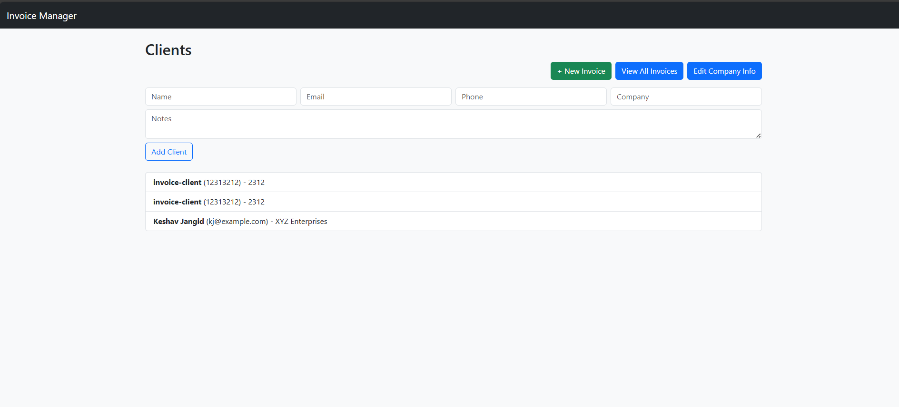
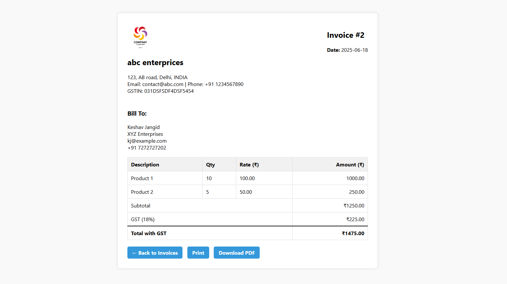
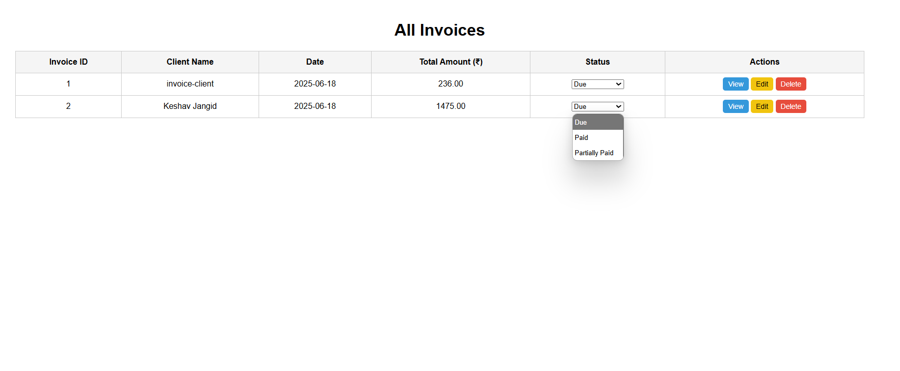
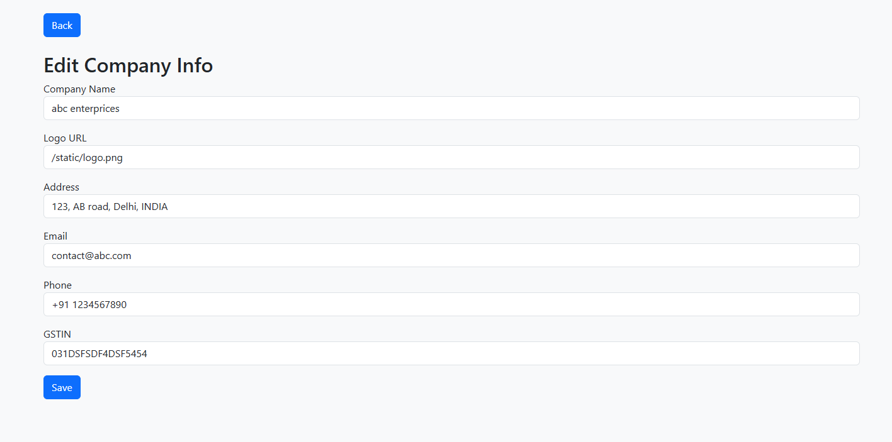
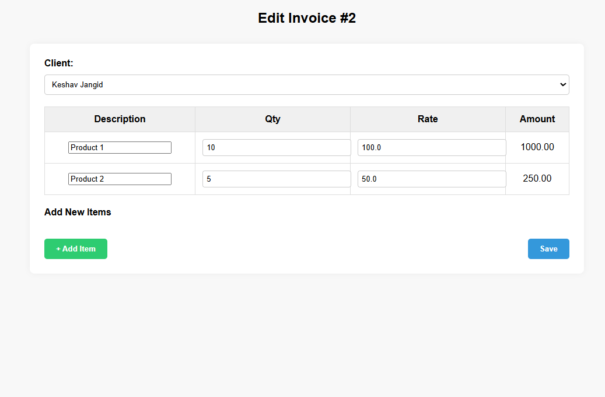

# 🧾 Invoice & Client Manager using Flask

An intuitive web application built with **Flask** to manage clients and generate clean, printable **PDF invoices**. Easily customizable with your own business name, logo, and tax information.







---

## 🚀 Features

- 🧍 Add and manage **clients**
- 🧾 Create and view **invoices**
- 💾 Store invoice data persistently (JSON-based)
- 📥 Download invoices as **PDF**
- 🖨 Print-friendly invoice view
- 🏢 Editable **company profile** (logo, GSTIN, contact info, etc.)

---

## 🛠 Tech Stack

- **Backend**: Python, Flask
- **Frontend**: HTML, Bootstrap, Jinja2
- **PDF Generation**: WeasyPrint
- **Storage**: JSON files (for easy setup)

---

## 📁 Folder Structure

```
invoice-manager/
│
├── static/
│ ├── logo.png
│ └── readme/ (for screenshots)
│
├── templates/
│ ├── base.html
│ ├── clients.html
│ ├── invoices.html
│ └── invoice_details.html
│
├── data/
│ ├── clients.json
│ ├── invoices.json
│ └── company.json
│
├── app.py
└── README.md
```

---

## 🧪 Local Setup

```bash
# Clone the repo
git clone https://github.com/ksv-py/invoice-manager.git
cd invoice-manager

# Create and activate virtual environment
python -m venv venv
source venv/bin/activate  # Windows: venv\Scripts\activate

# Install dependencies
pip install -r requirements.txt

# Run the app
python app.py
```

Now visit http://127.0.0.1:5000 in your browser.

---

## 🖊 Customization

Update your company profile in data/company.json:

```json
{
  "name": "ABC Enterprises",
  "logo": "/static/logo.png",
  "address": "123 Street, City, Country",
  "email": "contact@abc.com",
  "phone": "+91-1234567890",
  "gst": "29ABCDE1234F2Z5"
}

```

## 💡 Future Improvements

- Export to Excel/CSV
- Invoice reminders
- Client search/filter
- Admin login

## 🙌 Contributing

Pull requests and suggestions are welcome!

## 📄 License

This project is licensed under the MIT License.

Made with ❤️ by KESHAV JANGID
